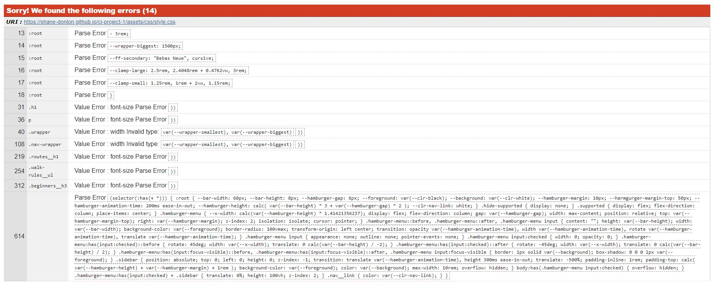
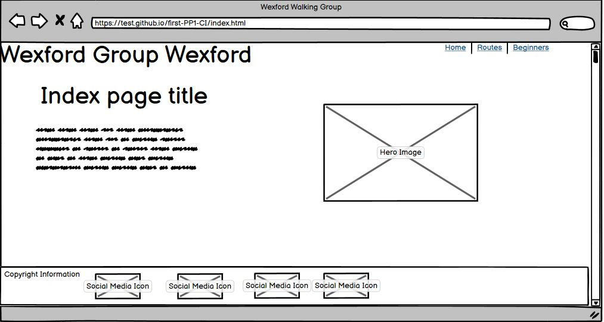

# Wexford Walking Group 
[Deployment Link](https://shane-donlon.github.io/ci-project-1/index.html)

## Site Preview

## Project Goals
Wexford Walking Group is a voluntary group of dog owners, who are keen to have other likeminded people join their group. The group meets up regularly for walks, or just to chill out with some coffee and friends, the weekly coffee is always best because there is cake there.

## User Stores
<ul>
  <li>As a new user</li>
   <ul>
    <li>I want to click on the company name and be taken to the home page.</li>
    <li>I want to click home and be taken to the home page.</li>
    <li>I want to click routes and be taken to the page with route information.</li>
    <li>I want to click beginners and be taken to a page with guidance on how to walk a dog.</li>
   </ul>
  <li>As a returning user</li>
  <ul>
    <li>I want a website that feels familiar but also a website that is quick to navigate to find route options with ease.</li>
  </ul>

  <li>As an accessible new user</li>
  <ul>
    <li>I want a website that is easy to navigate.</li>
  </ul>

  
  <li>As an accessible returning user</li>
  <ul>
    <li>I want to be able to skip the navigation bar</li>
  </ul>
</ul>

## Technology Used
### Languages
- [HTML](https://developer.mozilla.org/en-US/docs/Web/HTML): the markup language used to create the website.
- [CSS](https://developer.mozilla.org/en-US/docs/Web/css): the styling language used to style the website.

JavaScript was not used on this site, as it was a HTML and CSS only challenge, if JavaScript was allowed for this I would have used an Event Listener and Arrow Function like below to toggle the active class on the hamburger menu

    hamgurgerMenu = document.querySelector(".hamburger-menu");
    navBar = document.querySelector(".nav");

    hamgurgerMenu.addEventListener("click", () => {
      navBar.classList.toggle("active");
    });

## Site Features
### All pages
- All links on hover have an animation and cursor pointer has been set to convey that they are hover a link

- All links on focus (tab) have the same animation as hover for tab users to track their location on the page, footer focus outline visible only!

- A skip to content link is added on every page for accessilbity users to skip the navigation menu for returning users

- Both light and dark modes are set per user preferances.
(see site previews above)
- Reduced animation used and set per user preferences

- A hamburger menu has been added as this is an expectation of users for sites 

- A feature query is used to automatically change to hamburger menu on supported platforms

- Selection color has been used to carry the branding (on light and dark mode) but also the default blue does not work well with the theme colors

### Index Page
- The waggling animation has been used to attract users attention and to convey the idea of a dogs tail waggling and being happy.
- This animation does not appear for those with reduced animation preferences.
- This animation does not appear for mobile devices to keep site speed fast.

### Routes Page
- ABBR has been used to set the context from KM to kilometer

### Beginners Page
- The newsletter form on this page has a red required outline
- Upon valid input the color changes from red to green to give the visual feedback for the user

## UX
The website was designed to be intuitive, and easy to navigate, and to be quick to get to the information needed, with a focus on user system preferences, and accessibility. As this site is for a dog walking group, I also wanted to include fun for the users through animations and interest.
The CSS :: selection pseudo element was also styled (for both dark and light modes) as part of this fun and interesting part of the site.
On the Index page, the waggling animation was included to represent that of a dog’s tail.
The  ::after pseudo elements on the navigation links and form buttons were included to add animations to the hover and focus states. 
The focuses were on these as for me, if the user has a system preference, I believe that as developers we should accommodate these as much as possible.
As well as having a high focus on accessibility. As a developer I believe that the internet is for everyone a fundamental belief for me is that if a site is not accessible a step in the development process has been missed, adding accessibility is not an extra step in the process.
Examples of where this can be found:

<ul>
  <li>
    If the user has a preference set for reduced motion, the animations are
    slowed down, and overall animation is reduced. This is to reduce animations
    that can make users nauseous (vestibular dysfunction) to test this in Chrome
  </li>
  <ol>
    <li>Go to Inspect</li>
    <li>Select the 3 dots beside the X for close</li>
    <li>Select “Run command”</li>
    <li>Search for “Reduced”</li>
    <li>Click the “Do not emulate CSS prefers-reduced-motion”</li>
    <li>
      Refresh the Index.html page and the “waggling” animation will not appear.
    </li>
    <li>To undo this open the site in a new tab.</li>
  </ol>

  <li>
    If the users have a preference set for dark mode, this is considered and the
    site will load in dark mode, if not, the site will load in light mode. Some
    styling changes were made for the “waggling” animation to improve contrast
    on dark mode, as well as the header is coloured for dark mode. To test this
    change your browser settings to either dark mode or to light mode. 
    The meta tag for color scheme was used so that even if the css style sheet does not load, the background 
    will be that of the theme picked, and will not "jump" from light to dark as the css files load.
  </li>
 
  If you are on dark mode already (black background)
  <ol>
    <li>Go to Inspect</li>
    <li>Select the 3 dots beside the X for close</li>
    <li>Select “Run command”</li>
    <li>Search for "light"</li>
    <li>Click on “Emulate CSS prefers-color-scheme: light”</li>
    <li>The colour scheme should change to a white background</li>
    <li>To undo this open the site in a new tab.</li>
  </ol>
   
  If you are already on light mode (white background)
  <ol>
    <li>Go to Inspect</li>
    <li>Select the 3 dots beside the X for close</li>
    <li>Select “Run command”</li>
    <li>Search for “dark”</li>
    <li>Click on “Emulate CSS prefers-color-scheme: dark”</li>
    <li>The colour scheme should change to a dark background</li>
    <li>To undo this open the site in a new tab.</li>
  </ol>

  <li>
    A “skip to content” link is added to every page, this is hidden from view
    until you tab onto this. This was placed before the branding, and navigation
    bar, as this designed to give those using screen readers an option of not
    having to tab through the navigation bar to reach the main section, if you
    click on this link the page will scroll to the main section. This was not
    styled as this is intended for screen readers only. This was styled the same
    as the navigation links as some users have a tab preference, and styling was
    added for sighted users.
  </li>

  <li>
    Focus states were included as well as hover states, so that any link /
    button animations are also “triggered” by using tab to accommodate tab
    navigation preferences (using tab key on keyboard) and that they can tell
    where on the screen that they currently are. This does not apply to the Font
    Awesome Social Media Icons, but an outline is visible when tab selected.
  </li>

  <li>
    Role = List was also used for those on older browsers and screen readers,
    this is to introduce the user that there is a list of grouped combinations
    of items.
  </li>

  <li>
    ARIA labels were used for the footer links to provide context that the pages
    open in a new tab. I did not use a “opens in same page” label for navigation
    links, as a screen reader will announce when the page has been loaded, and
    this additional context was not needed.
  </li>
</ul>

### Semantic HTML
Semantic HTML was also used on this site to provide additional context for accessibility.
Overall Semantic HTML elements used:

<ul>
  <li>Header</li>
  <li>Nav</li>
  <li>Main</li>
  <li>Section</li>
  <li>Footer</li>
  <li>H1</li>
  <li>H2</li>
  <li>H3</li>
  <li>Unordered List (UL) as the list provided did not require an order.</li>
</ul>

Below you will find a brief explaination for some of my Symantec HTML decisions made
<ol>
  <li>Index Page</li>
  <ul>
    <li>
      The section element was not used on these pages as there is only a main
      “section” on the page and did not want to cause confusion for accessible
      users. All other pages have a
      <section></section>
      element.
    </li>
  </ul>
  <li>Routes page</li>
  <ul>
    <li>
      A strong element was used for the bold text “important that everyone
      follows them” to provide additional context for screen readers, as I
      believe that these rules are important for everyone to follow.
    </li>
  </ul>
  <li>Success page</li>
  <ul><li>The em element was used on the success page for a similar reason, I want to set the same emphasis for accessible and sighted users.</li></ul>
</ol>

While the user of multiple H1’s per page is allowed, for accessibility purposes I prefer to err on the side of caution and used 1 H1 per page. 
As well as with my reset.css all User Agent styling was taken away, this was done intentionally as all fonts are the same, and I do not fall into the “it looks like a H1, so I’ll use a H1” mentality. 

## Color Scheme

The site has 3 main colours that are used in a variety of ways brown, black and white.
These colours were used to mimic that of a Bernese Mountain Dog to keep the dog theme throughout this site.

<em> The dark theme background colour is decided by the browser and is not part of the colour palette. </em>

As previously mentioned the selection colours were also changed to black background white text / white background black text, depending on the theme used.
This was to keep in-line with the branding color choices (default is blue selection which is not part of the branding)
To see this simply use your mouse to select text (hold down the click and drag the mouse over the text / ctrl + a)

Notes: When using Wave a number of contrast errors appear

But upon manual verficiation all colors used have passed WCAG AA and WCAG AAA.

## Fonts

The primary font of the site is Roboto, this was used as it has a variety of weights and styles available for the site, and it was chosen as it could be dynamic in weights and styles. 

The secondary font of the site is Bebas Neue this was chosen as it is an uppercase font, but also the weight was appealing as a secondary font.
I intentionally kept both fonts a Sans-Serif font as to complement each other.

A paragraph length was also used to ensure that no head turning is required to read long sentences on larger screens. 
Font weights are not heavily prevalent in the site as this is informal, but also as over-relying on weights can reduce their impact.

## Testing
As a note before we disucss testing. 

The hamburger menu was created using CSS :has which is curently only supported in Chrome and Safari (technical preview) see [can I use](https://caniuse.com/css-has) 

This was taken into consideration, and I have built the hamburger menu into a Feature Query in CSS, meaning that when Firefox supports :has() it will automatically become a hamburger menu without having to write any new code.

As a fall back for this, browswers that do not support :has() will have the navigation links wrap to the top beside the branding.
See images below. This was all a consious decision as browswer support for :has() is currently at 86.93% (see can I use link above) globally and it is a good time for me, to start to push the bounderies with this psuedo class to get a better understanding of it. Also this is a personal project, so I have no issues with being experimental with newer elements, but still being consious of browswer support. But also it was a good time to practice my feature query skills in css (@supports)

As the nav bar is as designed tests some tests will not apply for Firefox and will be marked as not applicable "N/A"

Firefox Menu Screenshot

Chrome Menu Screenshot

<table>
  <th>Testing Number</th>
  <th>Testing Description</th>
  <th>Result Chrome</th>
  <th>Result Chrome Mobile</th>
  <th>Result Firefox</th>
  <th>Result Firefox Mobile</th>
  <th>Result Safari Tablet</th>
  <tr>
    <td>1</td>
    <td>Website Loads</td>
    <td>Pass</td>
    <td>Pass</td>
    <td>Pass</td>
    <td>Pass</td>
    <td>Pass</td>
  </tr>

  <tr>
    <td>2</td>
    <td>Wagggling Animation index page does not laod on mobile</td>
    <td>Not Applicable</td>
    <td>Pass</td>
    <td>Not Applicable</td>
    <td>Pass</td>
    <td>Pass</td>
  </tr>

  <tr>
    <td>3</td>
    <td>Wagggling Animation index page does laod on desktop</td>
    <td>Pass</td>
    <td>Not Applicable</td>
    <td>Pass</td>
    <td>Not Applicable</td>
    <td>Not Applicable</td>
  </tr>

  <tr>
    <td>4</td>
    <td>Index page hero image loads</td>
    <td>Pass</td>
    <td>Pass</td>
    <td>Pass</td>
    <td>Pass</td>
    <td>Pass</td>
  </tr>

  <tr>
    <td>5</td>
    <td>Navigation Links go to correct pages (index page)</td>
    <td>Pass</td>
    <td>Pass</td>
    <td>Pass</td>
    <td>Pass</td>
    <td>Pass</td>
  </tr>

  <tr>
    <td>6</td>
    <td>Footer links open in new tab (index pages)</td>
    <td>Pass</td>
    <td>Pass</td>
    <td>Pass</td>
    <td>Pass</td>
    <td>Pass</td>
  </tr>

  <tr>
    <td>7</td>
    <td>Navigation Links go to correct pages (routes page)</td>
    <td>Pass</td>
    <td>Pass</td>
    <td>Pass</td>
    <td>Pass</td>
    <td>Pass</td>
  </tr>

  <tr>
    <td>8</td>
    <td>Footer links open in new tab (routes pages)</td>
    <td>Pass</td>
    <td>Pass</td>
    <td>Pass</td>
    <td>Pass</td>
    <td>Pass</td>
  </tr>

  <tr>
    <td>9</td>
    <td>Navigation Links go to correct pages (beginners page)</td>
    <td>Pass</td>
    <td>Pass</td>
    <td>Pass</td>
    <td>Pass</td>
    <td>Pass</td>
  </tr>

  <tr>
    <td>10</td>
    <td>Footer links open in new tab (beginners pages)</td>
    <td>Pass</td>
    <td>Pass</td>
    <td>Pass</td>
    <td>Pass</td>
    <td>Pass</td>
  </tr>

  <tr>
    <td>11</td>
    <td>Navigation links open in new tab (success pages)</td>
    <td>Pass</td>
    <td>Pass</td>
    <td>Pass</td>
    <td>Pass</td>
    <td>Pass</td>
  </tr>

  <tr>
    <td>12</td>
    <td>Footer links open in new tab (success pages)</td>
    <td>Pass</td>
    <td>Pass</td>
    <td>Pass</td>
    <td>Pass</td>
    <td>Pass</td>
  </tr>

  <tr>
    <td>13</td>
    <td>Skip to content appears on tab (index page)</td>
    <td>Pass</td>
    <td>Not Applicable</td>
    <td>Pass</td>
    <td>Not Applicable</td>
    <td>Not Applicable</td>
  </tr>

  <tr>
    <td>14</td>
    <td>Skip to content appears on tab (routes page)</td>
    <td>Pass</td>
    <td>Not Applicable</td>
    <td>Pass</td>
    <td>Not Applicable</td>
    <td>Not Applicable</td>
  </tr>

  <tr>
    <td>15</td>
    <td>Skip to content appears on tab (routes page)</td>
    <td>Pass</td>
    <td>Not Applicable</td>
    <td>Pass</td>
    <td>Not Applicable</td>
    <td>Not Applicable</td>
  </tr>

  <tr>
    <td>16</td>
    <td>Skip to content appears on tab (sucess page)</td>
    <td>Pass</td>
    <td>Not Applicable</td>
    <td>Pass</td>
    <td>Not Applicable</td>
    <td>Not Applicable</td>
  </tr>

  <tr>
    <td>17</td>
    <td>Skip to content click and enter goes to main (index page)</td>
    <td>Pass</td>
    <td>Not Applicable</td>
    <td>Pass</td>
    <td>Not Applicable</td>
    <td>Not Applicable</td>
  </tr>

  <tr>
    <td>18</td>
    <td>Skip to content click and enter goes to main (routes page)</td>
    <td>Pass</td>
    <td>Not Applicable</td>
    <td>Pass</td>
    <td>Not Applicable</td>
    <td>Not Applicable</td>
  </tr>

  <tr>
    <td>19</td>
    <td>Skip to content click and enter goes to main (beginners page)</td>
    <td>Pass</td>
    <td>Not Applicable</td>
    <td>Pass</td>
    <td>Not Applicable</td>
    <td>Not Applicable</td>
  </tr>

  <tr>
    <td>20</td>
    <td>Skip to content click and enter goes to main (success page)</td>
    <td>Pass</td>
    <td>Not Applicable</td>
    <td>Pass</td>
    <td>Not Applicable</td>
    <td>Not Applicable</td>
  </tr>

  <tr>
    <td>21</td>
    <td>Hamburger menu appears on mobile devices (index page)</td>
    <td>Not Applicable</td>
    <td>Pass</td>
    <td>Not Applicable</td>
    <td>Pass</td>
    <td>Pass</td>
  </tr>

  <tr>
    <td>22</td>
    <td>Hamburger menu appears on mobile devices (routes page)</td>
    <td>Not Applicable</td>
    <td>Pass</td>
    <td>Not Applicable</td>
    <td>Pass</td>
    <td>Pass</td>
  </tr>

  <tr>
    <td>23</td>
    <td>Hamburger menu appears on mobile devices (beginners page)</td>
    <td>Not Applicable</td>
    <td>Pass</td>
    <td>Not Applicable</td>
    <td>Pass</td>
    <td>Pass</td>
  </tr>

  <tr>
    <td>24</td>
    <td>Hamburger menu appears on mobile devices (success page)</td>
    <td>Not Applicable</td>
    <td>Pass</td>
    <td>Not Applicable</td>
    <td>Pass</td>
    <td>Pass</td>
  </tr>

  <tr>
    <td>25</td>
    <td>
      Nacigation Links Animate on hover and tab / focus desktop only (index
      page)
    </td>
    <td>Pass</td>
    <td>Not Applicable</td>
    <td>Pass</td>
    <td>Not Applicable</td>
    <td>Not Applicable</td>
  </tr>

  <tr>
    <td>26</td>
    <td>
      Nacigation Links Animate on hover and tab / focus desktop only (routes
      page)
    </td>
    <td>Pass</td>
    <td>Not Applicable</td>
    <td>Pass</td>
    <td>Not Applicable</td>
    <td>Not Applicable</td>
  </tr>

  <tr>
    <td>27</td>
    <td>
      Nacigation Links Animate on hover and tab / focus desktop only (beginners
      page)
    </td>
    <td>Pass</td>
    <td>Not Applicable</td>
    <td>Pass</td>
    <td>Not Applicable</td>
    <td>Not Applicable</td>
  </tr>

  <tr>
    <td>28</td>
    <td>
      Nacigation Links Animate on hover and tab / focus desktop only (success
      page)
    </td>
    <td>Pass</td>
    <td>Not Applicable</td>
    <td>Pass</td>
    <td>Not Applicable</td>
    <td>Not Applicable</td>
  </tr>

  <tr>
    <td>29</td>
    <td>
      Join Us Link Animate on hover and tab / focus desktop only (index page)
    </td>
    <td>Pass</td>
    <td>Not Applicable</td>
    <td>Pass</td>
    <td>Not Applicable</td>
    <td>Not Applicable</td>
  </tr>

  <tr>
    <td>30</td>
    <td>Footer Links Animate on hover desktop only (index page)</td>
    <td>Pass</td>
    <td>Not Applicable</td>
    <td>Pass</td>
    <td>Not Applicable</td>
    <td>Not Applicable</td>
  </tr>

  <tr>
    <td>31</td>
    <td>Footer Links Animate on hover desktop only (routes page)</td>
    <td>Pass</td>
    <td>Not Applicable</td>
    <td>Pass</td>
    <td>Not Applicable</td>
    <td>Not Applicable</td>
  </tr>

  <tr>
    <td>32</td>
    <td>Footer Links Animate on hover desktop only (beginners page)</td>
    <td>Pass</td>
    <td>Not Applicable</td>
    <td>Pass</td>
    <td>Not Applicable</td>
    <td>Not Applicable</td>
  </tr>

  <tr>
    <td>33</td>
    <td>Footer Links Animate on hover desktop only (sucess page)</td>
    <td>Pass</td>
    <td>Not Applicable</td>
    <td>Pass</td>
    <td>Not Applicable</td>
    <td>Not Applicable</td>
  </tr>

  <tr>
    <td>34</td>
    <td>Footer Links Animate on active mobile only (index page)</td>
    <td>Not Applicable</td>
    <td>Pass</td>
    <td>Not Applicable</td>
    <td>Pass</td>
    <td>Pass</td>
  </tr>

  <tr>
    <td>35</td>
    <td>Footer Links Animate on active mobile only (routes page)</td>
    <td>Not Applicable</td>
    <td>Pass</td>
    <td>Not Applicable</td>
    <td>Pass</td>
    <td>Pass</td>
  </tr>

  <tr>
    <td>36</td>
    <td>Footer Links Animate on active mobile only (beginners page)</td>
    <td>Not Applicable</td>
    <td>Pass</td>
    <td>Not Applicable</td>
    <td>Pass</td>
    <td>Pass</td>
  </tr>

  <tr>
    <td>37</td>
    <td>Footer Links Animate on active mobile only (sucess page)</td>
    <td>Not Applicable</td>
    <td>Pass</td>
    <td>Not Applicable</td>
    <td>Pass</td>
    <td>Pass</td>
  </tr>

  <tr>
    <td>38</td>
    <td>Page Responsive for mobile only (index page)</td>
    <td>Not Applicable</td>
    <td>Pass</td>
    <td>Not Applicable</td>
    <td>Pass</td>
    <td>Pass</td>
  </tr>

  <tr>
    <td>39</td>
    <td>Page Responsive for mobile only (routes page)</td>
    <td>Not Applicable</td>
    <td>Pass</td>
    <td>Not Applicable</td>
    <td>Pass</td>
    <td>Pass</td>
  </tr>

  <tr>
    <td>40</td>
    <td>Page Responsive for mobile only (beginners page)</td>
    <td>Not Applicable</td>
    <td>Pass</td>
    <td>Not Applicable</td>
    <td>Pass</td>
    <td>Pass</td>
  </tr>

  <tr>
    <td>41</td>
    <td>Page Responsive for mobile only (sucess page)</td>
    <td>Not Applicable</td>
    <td>Pass</td>
    <td>Not Applicable</td>
    <td>Pass</td>
    <td>Pass</td>
  </tr>

  <tr>
    <td>42</td>
    <td>Dark mode (index page)</td>
    <td>Pass</td>
    <td>Pass</td>
    <td>Pass</td>
    <td>Pass</td>
    <td>Pass</td>
  </tr>

  <tr>
    <td>43</td>
    <td>Dark mode (routes page)</td>
    <td>Pass</td>
    <td>Pass</td>
    <td>Pass</td>
    <td>Pass</td>
    <td>Pass</td>
  </tr>

  <tr>
    <td>44</td>
    <td>Dark mode (beginners page)</td>
    <td>Pass</td>
    <td>Pass</td>
    <td>Pass</td>
    <td>Pass</td>
    <td>Pass</td>
  </tr>

  <tr>
    <td>45</td>
    <td>Dark mode (success page)</td>
    <td>Pass</td>
    <td>Pass</td>
    <td>Pass</td>
    <td>Pass</td>
    <td>Pass</td>
  </tr>

  <tr>
    <td>46</td>
    <td>Light mode (index page)</td>
    <td>Pass</td>
    <td>Pass</td>
    <td>Pass</td>
    <td>Pass</td>
    <td>Pass</td>
  </tr>

  <tr>
    <td>47</td>
    <td>Light mode (routes page)</td>
    <td>Pass</td>
    <td>Pass</td>
    <td>Pass</td>
    <td>Pass</td>
    <td>Pass</td>
  </tr>

  <tr>
    <td>48</td>
    <td>Light mode (beginners page)</td>
    <td>Pass</td>
    <td>Pass</td>
    <td>Pass</td>
    <td>Pass</td>
    <td>Pass</td>
  </tr>

  <tr>
    <td>49</td>
    <td>Light mode (success page)</td>
    <td>Pass</td>
    <td>Pass</td>
    <td>Pass</td>
    <td>Pass</td>
    <td>Pass</td>
  </tr>

  <tr>
    <td>50</td>
    <td>Selection colour light mode (all devices) (index page)</td>
    <td>Pass</td>
    <td>Pass</td>
    <td>Pass</td>
    <td>Pass</td>
    <td>Pass</td>
  </tr>

  <tr>
    <td>51</td>
    <td>Selection colour light mode (all devices) (routes page)</td>
    <td>Pass</td>
    <td>Pass</td>
    <td>Pass</td>
    <td>Pass</td>
    <td>Pass</td>
  </tr>

  <tr>
    <td>52</td>
    <td>Selection colour light mode (all devices) (beginners page)</td>
    <td>Pass</td>
    <td>Pass</td>
    <td>Pass</td>
    <td>Pass</td>
    <td>Pass</td>
  </tr>

  <tr>
    <td>53</td>
    <td>Selection colour light mode (all devices) (success page)</td>
    <td>Pass</td>
    <td>Pass</td>
    <td>Pass</td>
    <td>Pass</td>
    <td>Pass</td>
  </tr>

  <tr>
    <td>54</td>
    <td>
      Walking Group Wexford branding links to index page (all devices) (index
      page)
    </td>
    <td>Pass</td>
    <td>Pass</td>
    <td>Pass</td>
    <td>Pass</td>
    <td>Pass</td>
  </tr>

  <tr>
    <td>55</td>
    <td>
      Walking Group Wexford branding links to index page (all devices) (routes
      page)
    </td>
    <td>Pass</td>
    <td>Pass</td>
    <td>Pass</td>
    <td>Pass</td>
    <td>Pass</td>
  </tr>

  <tr>
    <td>56</td>
    <td>
      Walking Group Wexford branding links to index page (all devices)
      (beginners page)
    </td>
    <td>Pass</td>
    <td>Pass</td>
    <td>Pass</td>
    <td>Pass</td>
    <td>Pass</td>
  </tr>

  <tr>
    <td>57</td>
    <td>
      Walking Group Wexford branding links to index page (all devices) (success
      page)
    </td>
    <td>Pass</td>
    <td>Pass</td>
    <td>Pass</td>
    <td>Pass</td>
    <td>Pass</td>
  </tr>

  <tr>
    <td>58</td>
    <td>
      Walking Group Wexford branding links cursor pointer on hover (desktop
      only) (index page)
    </td>
    <td>Pass</td>
    <td>Not Applicable</td>
    <td>Pass</td>
    <td>Not Applicable</td>
    <td>Not Applicable</td>
  </tr>

  <tr>
    <td>59</td>
    <td>
      Walking Group Wexford branding links cursor pointer on hover (desktop
      only) (routes page)
    </td>
    <td>Pass</td>
    <td>Not Applicable</td>
    <td>Pass</td>
    <td>Not Applicable</td>
    <td>Not Applicable</td>
  </tr>

  <tr>
    <td>60</td>
    <td>
      Walking Group Wexford branding links cursor pointer on hover (desktop
      only) (beginners page)
    </td>
    <td>Pass</td>
    <td>Not Applicable</td>
    <td>Pass</td>
    <td>Not Applicable</td>
    <td>Not Applicable</td>
  </tr>

  <tr>
    <td>61</td>
    <td>
      Walking Group Wexford branding links cursor pointer on hover (desktop
      only) (success page)
    </td>
    <td>Pass</td>
    <td>Not Applicable</td>
    <td>Pass</td>
    <td>Not Applicable</td>
    <td>Not Applicable</td>
  </tr>

  <tr>
    <td>62</td>
    <td>
      Navigation Links cursor pointer on hover (desktop only) (index page)
    </td>
    <td>Pass</td>
    <td>Not Applicable</td>
    <td>Pass</td>
    <td>Not Applicable</td>
    <td>Not Applicable</td>
  </tr>

  <tr>
    <td>63</td>
    <td>
      Navigation Links cursor pointer on hover (desktop only) (routes page)
    </td>
    <td>Pass</td>
    <td>Not Applicable</td>
    <td>Pass</td>
    <td>Not Applicable</td>
    <td>Not Applicable</td>
  </tr>

  <tr>
    <td>64</td>
    <td>
      Navigation Links cursor pointer on hover (desktop only) (beginners page)
    </td>
    <td>Pass</td>
    <td>Not Applicable</td>
    <td>Pass</td>
    <td>Not Applicable</td>
    <td>Not Applicable</td>
  </tr>

  <tr>
    <td>65</td>
    <td>
      Navigation Links cursor pointer on hover (desktop only) (success page)
    </td>
    <td>Pass</td>
    <td>Not Applicable</td>
    <td>Pass</td>
    <td>Not Applicable</td>
    <td>Not Applicable</td>
  </tr>

  <tr>
    <td>66</td>
    <td>Footer Links cursor pointer on hover (desktop only) (index page)</td>
    <td>Pass</td>
    <td>Not Applicable</td>
    <td>Pass</td>
    <td>Not Applicable</td>
    <td>Not Applicable</td>
  </tr>

  <tr>
    <td>67</td>
    <td>Footer Links cursor pointer on hover (desktop only) (routes page)</td>
    <td>Pass</td>
    <td>Not Applicable</td>
    <td>Pass</td>
    <td>Not Applicable</td>
    <td>Not Applicable</td>
  </tr>

  <tr>
    <td>68</td>
    <td>
      Footer Links cursor pointer on hover (desktop only) (beginners page)
    </td>
    <td>Pass</td>
    <td>Not Applicable</td>
    <td>Pass</td>
    <td>Not Applicable</td>
    <td>Not Applicable</td>
  </tr>

  <tr>
    <td>69</td>
    <td>Footer Links cursor pointer on hover (desktop only) (success page)</td>
    <td>Pass</td>
    <td>Not Applicable</td>
    <td>Pass</td>
    <td>Not Applicable</td>
    <td>Not Applicable</td>
  </tr>

  <tr>
    <td>70</td>
    <td>
      Abbreviation HTML routes page only hover mouse over KM and leave for a few
      seconds (desktop only) (routes page)
    </td>
    <td>Pass</td>
    <td>Not Applicable</td>
    <td>Pass</td>
    <td>Not Applicable</td>
    <td>Not Applicable</td>
  </tr>

  <tr>
    <td>71</td>
    <td>Input Form contains red border for required input (beginners page)</td>
    <td>Pass</td>
    <td>Pass</td>
    <td>Pass</td>
    <td>Pass</td>
    <td>Pass</td>
  </tr>

  <tr>
    <td>72</td>
    <td>Input Form contains green border for valid input (beginners page)</td>
    <td>Pass</td>
    <td>Pass</td>
    <td>Pass</td>
    <td>Pass</td>
    <td>Pass</td>
  </tr>

  <tr>
    <td>73</td>
    <td>
      Submit button redirects to success page upon valid input fields completed
      correctly (beginners page)
    </td>
    <td>Pass</td>
    <td>Pass</td>
    <td>Pass</td>
    <td>Pass</td>
    <td>Pass</td>
  </tr>

  <tr>
    <td>74</td>
    <td>Reset Form button clears all data from form (beginners page)</td>
    <td>Pass</td>
    <td>Pass</td>
    <td>Pass</td>
    <td>Pass</td>
    <td>Pass</td>
  </tr>

  <tr>
    <td>75</td>
    <td>
      Required Field First Name cannot submit if blank or incomplete (error
      appears) (beginners page)
    </td>
    <td>Pass</td>
    <td>Pass</td>
    <td>Pass</td>
    <td>Pass</td>
    <td>Pass</td>
  </tr>

  <tr>
    <td>76</td>
    <td>
      Required Field Surname cannot submit if blank or incomplete (error
      appears) (beginners page)
    </td>
    <td>Pass</td>
    <td>Pass</td>
    <td>Pass</td>
    <td>Pass</td>
    <td>Pass</td>
  </tr>

  <tr>
    <td>77</td>
    <td>
      Required Field email cannot submit if blank or incomplete (error appears)
      (beginners page)
    </td>
    <td>Pass</td>
    <td>Pass</td>
    <td>Pass</td>
    <td>Pass</td>
    <td>Pass</td>
  </tr>

  <tr>
    <td>78</td>
    <td>
      Submit Button cursor pointer on hover (desktop only) (beginners page)
    </td>
    <td>Pass</td>
    <td>Not Applicable</td>
    <td>Pass</td>
    <td>Not Applicable</td>
    <td>Not Applicable</td>
  </tr>

  <tr>
    <td>79</td>
    <td>
      Reset Form button cursor pointer on hover (desktop only) (beginners page)
    </td>
    <td>Pass</td>
    <td>Not Applicable</td>
    <td>Pass</td>
    <td>Not Applicable</td>
    <td>Not Applicable</td>
  </tr>

  <tr>
    <td>80</td>
    <td>
      Submit Button animates on hover and focus (desktop only) (beginners page)
    </td>
    <td>Pass</td>
    <td>Not Applicable</td>
    <td>Pass</td>
    <td>Not Applicable</td>
    <td>Not Applicable</td>
  </tr>

  <tr>
    <td>81</td>
    <td>
      Reset Form Button animates on hover and focus (desktop only) (beginners
      page)
    </td>
    <td>Pass</td>
    <td>Not Applicable</td>
    <td>Pass</td>
    <td>Not Applicable</td>
    <td>Not Applicable</td>
  </tr>

  <tr>
    <td>82</td>
    <td>
      Iframes Cursor Pointer on hover (desktop only) (beginners
      page)
    </td>
    <td>Pass</td>
    <td>Not Applicable</td>
    <td>Pass</td>
    <td>Not Applicable</td>
    <td>Not Applicable</td>
  </tr>

  <tr>
    <td>83</td>
    <td>
      Iframes play on click (beginners
      page)
    </td>
    <td>Pass</td>
    <td>Not Applicable</td>
    <td>Pass</td>
    <td>Not Applicable</td>
    <td>Not Applicable</td>
  </tr>

  <tr>
    <td>84</td>
    <td>
      Contrast Colour Checker Light Mode (index
      page)
    </td>
    <td>Pass</td>
    <td>Pass</td>
    <td>Pass</td>
    <td>Pass</td>
    <td>Pass</td>
  </tr>
  
   <tr>
    <td>85</td>
    <td>
      Contrast Colour Checker Light Mode (routes
      page)
    </td>
    <td>Pass</td>
    <td>Pass</td>
    <td>Pass</td>
    <td>Pass</td>
    <td>Pass</td>
  </tr>

 <tr>
    <td>86</td>
    <td>
      Contrast Colour Checker Light Mode (beginners
      page)
    </td>
    <td>Pass</td>
    <td>Pass</td>
    <td>Pass</td>
    <td>Pass</td>
    <td>Pass</td>
  </tr>
  
   <tr>
    <td>87</td>
    <td>
      Contrast Colour Checker Light Mode (success
      page)
    </td>
    <td>Pass</td>
    <td>Pass</td>
    <td>Pass</td>
    <td>Pass</td>
    <td>Pass</td>
  </tr>
<tr>
    <td>88</td>
    <td>
      Contrast Colour Checker Dark Mode (Index
      page)
    </td>
    <td>Pass</td>
    <td>Pass</td>
    <td>Pass</td>
    <td>Pass</td>
    <td>Pass</td>
  </tr>

  <tr>
    <td>89</td>
    <td>
      Contrast Colour Checker Dark Mode (routes
      page)
    </td>
    <td>Pass</td>
    <td>Pass</td>
    <td>Pass</td>
    <td>Pass</td>
    <td>Pass</td>
  </tr>
  
<tr>
    <td>90</td>
    <td>
      Contrast Colour Checker Dark Mode (beginners
      page)
    </td>
    <td>Pass</td>
    <td>Pass</td>
    <td>Pass</td>
    <td>Pass</td>
    <td>Pass</td>
  </tr>
  
  <tr>
    <td>91</td>
    <td>
      Contrast Colour Checker Dark Mode (success
      page)
    </td>
    <td>Pass</td>
    <td>Pass</td>
    <td>Pass</td>
    <td>Pass</td>
    <td>Pass</td>
  </tr>

   <tr>
    <td>92</td>
    <td>
     Wexford Walking Group Title appears (index
      page)
    </td>
    <td>Pass</td>
    <td>Pass</td>
    <td>Pass</td>
    <td>Pass</td>
    <td>Pass</td>
  </tr>
  
  <tr>
    <td>93</td>
    <td>
     Wexford Walking Group Title appears (routes
      page)
    </td>
    <td>Pass</td>
    <td>Pass</td>
    <td>Pass</td>
    <td>Pass</td>
    <td>Pass</td>
  </tr>
  
   <tr>
    <td>94</td>
    <td>
     Wexford Walking Group Title appears (beginners
      page)
    </td>
    <td>Pass</td>
    <td>Pass</td>
    <td>Pass</td>
    <td>Pass</td>
    <td>Pass</td>
  </tr>
  
   <tr>
    <td>95</td>
    <td>
     Wexford Walking Group Title appears (success
      page)
    </td>
    <td>Pass</td>
    <td>Pass</td>
    <td>Pass</td>
    <td>Pass</td>
    <td>Pass</td>
  </tr>
  
   <tr>
    <td>96</td>
    <td>
    Site favicon loads appears (index
      page)
    </td>
    <td>Pass</td>
    <td>Pass</td>
    <td>Pass</td>
    <td>Pass</td>
    <td>Pass</td>
  </tr>
  
   <tr>
    <td>97</td>
    <td>
    Site favicon loads appears (routes
      page)
    </td>
    <td>Pass</td>
    <td>Pass</td>
    <td>Pass</td>
    <td>Pass</td>
    <td>Pass</td>
  </tr>
  
  <tr>
    <td>98</td>
    <td>
    Site favicon loads appears (beginners
      page)
    </td>
    <td>Pass</td>
    <td>Pass</td>
    <td>Pass</td>
    <td>Pass</td>
    <td>Pass</td>
  </tr>
  
   <tr>
    <td>99</td>
    <td>
   Site favicon loads appears (success
      page)
    </td>
    <td>Pass</td>
    <td>Pass</td>
    <td>Pass</td>
    <td>Pass</td>
    <td>Pass</td>
  </tr>
  
</table>

Notes on the contrast this has also been verified by a person who has partial colour blindness and all words were legible (both light and dark modes)

## Code Validation
HTML Code has been validated with no errors, and 2 warnings regarding Role = list

CSS Code has been validated with errors, but this is due to the dynamic nature of custom properties in CSS,
This appears to be an issue with Jigsaw validation and not a code error.
The same issue appears for Grid Area - this is not a coding error rather than an issue with Jigsaw.

  

## Lighthouse reports

### Mobile Reports index and overall:

For mobile the performance has been measured as 88, this is primarily due to the static hero image that loads on the home-page, which a site of 32 KiB. 
While loading="lazy" attribute could be used here for desktop the image loads in view and it is best practice to not have unneccasry lazy load. The picture has been compressed as much as possible without losing too much quality, and any further compression of the image would have an incredibly poor quality introduction to the site, and would not encourage users to progress beyone the index page.

First Contentful Paint score = 2.5s.
Largerst Contentful Paint = 2.7s.

While this is being flagged as a "warning" in lighthouse, the best practice for loading is less than 3 seconds, as this is the average length of time users will wait for a page to load, as this site loads in 2.5s - 2.7s this is still within the average length and this performance would likely not deter the average user away from the site.

Accessiblitiy:
For this site on mobile this score is due to the empty label for checkbox, while I agree that JavaScript is best used for toggling classses (see above) this is a personal site and learning more on CSS :has() was a priority for me for this site.

If this were a fully production site JavaScript would be used for the Hamburger naviation (which would have an accessiblity score of 100%)

### Mobile Reports routes

### Mobile Reports beginners
Performance has declined for this page due to iFrame but is still within the 3 seconds so no further action was taken

### Desktop reports index

No scores to discuss for desktop.

### Desktop Reports routes

### Desktop Reports beginners

## Wireframes

### Desktop

Index Page

Routes Page

Beginners Page

### Mobile / Tablet

Index Page

Routes Page

Beginners Page

## Credits

- [Image Compressor](https://imagecompressor.com/)
- [Dog Favicon](https://icons8.com/icon/16018/dog)
- [Google Fonts - Bebas Neue](https://fonts.google.com/specimen/Bebas+Neue)
- [Google Fonts - Roboto](https://fonts.google.com/specimen/Roboto)
- [Facebook Social Media Link image (footer)](https://fontawesome.com/icons/facebook?f=brands&s=solid)
- [Twitter Social Media Link image (footer)](https://fontawesome.com/icons/twitter?f=brands&s=solid)
- [YouTube Social Media Link image (footer)](https://fontawesome.com/icons/youtube?f=brands&s=solid)
- [Instagram Social Media Link image (footer)](https://fontawesome.com/icons/instagram?f=brands&s=solid)
- [Poop Emoji used in rules page](https://fontawesome.com/v5/icons/poop?f=classic&s=solid)
- [Paw Icon used in link and buttons](https://fontawesome.com/icons/paw?f=classic&s=solid)
- [Andy Bell CSS Reset](https://andy-bell.co.uk/a-modern-css-reset/)
- [Balsamiq - wireframes](https://balsamiq.com/)
- [Home Page Hero Image](https://www.pexels.com/photo/two-bernese-mountain-dogs-lying-on-floor-9040438/)
- [Google Lighthouse](https://developer.chrome.com/docs/lighthouse/overview/)
- [Routes Image 1](https://static-maps.alltrails.com/production/at-map/79202755/v1-trail-ireland-county-wexford-tintern-trails-tintern-demesne-trail-at-map-79202755-1656102922-414w200h-en-US-i-2-style_3.png)
- [Routes Image 2](https://static-maps.alltrails.com/production/at-map/79202581/v1-trail-ireland-county-wexford-tintern-trails-bannow-bay-trail-at-map-79202581-1645174988-414w200h-en-US-i-2-style_3.png)
- [Routes Image 3](https://static-maps.alltrails.com/production/at-map/38108785/v1-trail-ireland-county-wexford-south-wexford-coastal-path-at-map-38108785-1645077296-300w250h-en-US-i-1-style_3.png)
- [Fenrir Canine Video 1](https://www.youtube.com/watch?v=D8h194DZ3XE&ab_channel=WillAthertonCanineTraining)
- [Fenrir Canine Video 2](https://www.youtube.com/watch?v=DgWGuOr8-Ro&ab_channel=WillAthertonCanineTraining)
- [Web Dev Simplified Hamburger Menu](https://www.youtube.com/watch?v=dAIVbLrAb_U&ab_channel=WebDevSimplified&themeRefresh=1)
- [PNG to ICO Converter](https://pngtoicon.com/)
- Darrach Barneveld - Classmate for feedback and testing
- Artem Marych - Classmate for feedback and testing
- Izabella Lopes - Classmate for feedback and testing
- [Aleksei Konovalov - for being an excellent mentor through this, and providing guidance. ](https://kh.linkedin.com/in/aleksei-konovalov/en?trk=people-guest_people_search-card)
- Last but not least - my better half Chloe, and Oscar for being an absolute rock and inspiration. Thank you!

## Deployment
The website was deployed using GitHub Pages:

In the GitHub repository navigate to the Settings tab
On the left-hand menu select Pages
For the source select Branch: master
After the web page refreshes automatically you will see a ribbon on the top saying: Your site is live at https://shane-donlon.github.io/ci-project-1/index.html
You can for fork the repository:

Go to the GitHub repository
Click on Fork button in the upper right-hand corner
Edit the repository name and description if desired
Click the green create fork button
You can clone the repository:

Go to the GitHub repository
Locate the green Code button above the list of files and click it
Select if you prefer to clone using HTTPS, SSH, or Github CLI and click the copy button to copy the URL to your clipboard
Open Git Bash
Change the current working directory to the one where you want the cloned directory
Type git clone and paste the URL from the clipboard ($ git clone https://github.com/YOUR-USERNAME/YOUR-REPOSITORY)
Press Enter to create your local clone.
You can run this repository locally:

Go to the GitHub repository
Locate the green Code button above the list of files and click it
From the dropdown menu select download Zip.
Download and open the zip file to run in an editor

## Learning Outcomes
| Learning Outcome | Achieved |
| --- | --- |
| Design a website that incorporates a main navigation menu and a structured layout | Navigation on all pages |
| Design a website that meets accessibility guidelines (e.g. contrast between background and foreground colours, non-text elements have planned alt text equivalents to cater for the visually impaired) | See screenshots below While there are contrast issues with normal text, the text in the brown and white is considered large text. |
| Design the organisation of information on the page following the principles of user experience design (headers are used to convey structure, information is easy to find due to being presented and categorised in terms of priority) | h1 h2 h3 styling has been used correctly |
| Ensure that foreground information is never distracted by backgrounds | This has been confirmed by testers of the site |
| Include graphics that are consistent in style and colour | All images used are consistent |
| Design the site to allow the user to initiate and control actions such as the playing of audio/video. | iFrames do not auto play and user has control |
| Create a website of at least three pages, or (if using a single scrolling page) at least three separate page areas to match the design and to meet its stated purpose | site currently has 4 pages |
| Write custom HTML code that passes through the official W3C validator with no issues. | Explained Above |
| Write custom CSS code that passes through the official (Jigsaw) validator with no issues | Explained Above |
| Incorporate images that are of sufficient resolution to not appear pixelated or stretched | This has been confirmed during testing |
| Code all external links to open in a separate tab when clicked | All footer links open in a new tab iFrame is inline, but can be opened on a new page |
| Use CSS media queries across the application to ensure the layout changes appropriately and maintains the page's structural integrity across device screen sizes. | Site is responsive on mobile / tablet |
| Use Semantic markup to structure HTML code |
| Present the finished website with clearly understandable site-specific content, rather than Lorem Ipsum placeholder text | All content is new and no placeholder |
| Implement clear navigation to allow users to find resources on the site intuitively. | This has been confirmed during testing |
| Deploy a final version of the code to a cloud-based hosting platform (e.g. GitHub Pages) and test to ensure it matches the development version | GitHub Pages has been used to deploy site |
| Use Git & GitHub for version control of an interactive web application up to deployment. | Confirmed as used with over 100 commits |
| Remove commented-out code before pushing final changes to version control and deploying. | Comments exist but not coded |
| Ensure that there are no broken internal links | Confirmed in testing |
| Insert screenshots of the finished project in the README | Confirmed |
| Write a README.md file for the web application that explains its purpose, the value that it provides to its users, and the deployment procedure. | Confirmed |
| Insert screenshots of the project features, give a brief description of what each feature does and explain its value to the user. | Confirmed |
| Attribute all code from external sources to its original source via comments above the code and (for larger dependencies) in the README. | Confirmed |
| Clearly separate and identify code written for the website and code from external sources (e.g. libraries or tutorials) | Confirmed external code is in reset.css file or accredited in the readme |
| Organise HTML and CSS code into well-defined and commented sections | Confirmed |
| Place CSS code in external files linked to the HTML page in the HEAD element. | Confirmed |
| Write code that meets at least minimum standards for readability (consistent indentation, blank lines only appear individually or, at most, in pairs) | Confirmed |
| Name files consistently and descriptively, without spaces or capitalisation to allow for cross-platform compatibility. | Confirmed |
| Group files in directories by file type (e.g. an assets directory will contain all static files and may be organised into sub-directories such as CSS, images, etc.) | Images in assets folder, css in assets folder, read me in documentation folder |
| Use consistent and effective markdown formatting to produce a README file in English that is well-structured, easy to follow, and has few grammatical errors. | Confirmed |

### Color contrast

